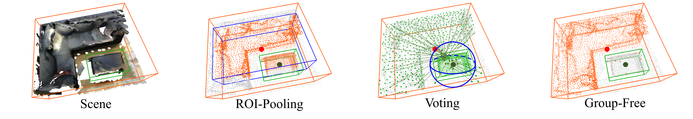

# Group-Free 3D Object Detection via Transformers
[](https://paperswithcode.com/sota/3d-object-detection-on-scannetv2?p=group-free-3d-object-detection-via)
[](https://paperswithcode.com/sota/3d-object-detection-on-sun-rgbd-val?p=group-free-3d-object-detection-via)

By [Ze Liu](https://github.com/zeliu98), [Zheng Zhang](https://github.com/stupidZZ), [Yue Cao](https://github.com/caoyue10), [Han Hu](https://github.com/ancientmooner), [Xin Tong](http://www.xtong.info/).

This repo is the official implementation of ["Group-Free 3D Object Detection via Transformers"](https://arxiv.org/abs/2104.00678).



**Updates**

- April 01, 2021: initial release.

## Introduction

Recently, directly detecting 3D objects from 3D point clouds has received increasing attention. To extract object
representation from an irregular point cloud, existing methods usually take a point grouping step to assign the points
to an object candidate so that a PointNet-like network could be used to derive object features from the grouped points.
However, the inaccurate point assignments caused by the hand-crafted grouping scheme decrease the performance of 3D
object detection. In this paper, we present a simple yet effective method for directly detecting 3D objects from the 3D
point cloud. Instead of grouping local points to each object candidate, our method computes the feature of an object
from all the points in the point cloud with the help of an attention mechanism in the Transformers, where the
contribution of each point is automatically learned in the network training. With an improved attention stacking scheme,
our method fuses object features in different stages and generates more accurate object detection results. With few
bells and whistles, the proposed method achieves state-of-the-art 3D object detection performance on two widely used
benchmarks, ScanNet V2 and SUN RGB-D.

In this repository, we provide model implementation (with Pytorch) as well as data preparation, training and evaluation
scripts on ScanNet and SUN RGB-D.

## Citation

```
@article{liu2021,
  title={Group-Free 3D Object Detection via Transformers},
  author={Liu, Ze and Zhang, Zheng and Cao, Yue and Hu, Han and Tong, Xin},
  journal={arXiv preprint arXiv:2104.00678},
  year={2021}
}
```

## Main Results

### ScanNet V2

|Method | backbone | mAP@0.25 | mAP@0.5 | Model |
|:---:|:---:|:---:|:---:|:---:|
|[HGNet](https://openaccess.thecvf.com/content_CVPR_2020/papers/Chen_A_Hierarchical_Graph_Network_for_3D_Object_Detection_on_Point_CVPR_2020_paper.pdf)| GU-net| 61.3 | 34.4 | - |
|[GSDN](https://arxiv.org/pdf/2006.12356.pdf)| MinkNet | 62.8 | 34.8 | [waiting for release](https://github.com/jgwak/GSDN) |
|[3D-MPA](https://arxiv.org/abs/2003.13867)| MinkNet | 64.2 | 49.2 |  [waiting for release](https://github.com/francisengelmann/3D-MPA) |
|[VoteNet](https://arxiv.org/abs/1904.09664) | PointNet++ | 62.9 | 39.9 | [official repo](https://github.com/facebookresearch/votenet) |
|[MLCVNet](https://arxiv.org/abs/2004.05679) | PointNet++ | 64.5 | 41.4 | [official repo](https://github.com/NUAAXQ/MLCVNet) |
|[H3DNet](https://arxiv.org/abs/2006.05682) | PointNet++ | 64.4 | 43.4 | [official repo](https://github.com/zaiweizhang/H3DNet) |
|[H3DNet](https://arxiv.org/abs/2006.05682) | 4xPointNet++ | 67.2| 48.1 | [official repo](https://github.com/zaiweizhang/H3DNet) |
| Ours(L6, O256) | PointNet++ | 67.3 (66.2*) | 48.9 (48.4*) |[model](https://drive.google.com/file/d/1aS3vsHtg1QU0yFGPa_-kdBmfGR7VTvY0/view?usp=sharing)|
| Ours(L12, O256) | PointNet++ | 67.2 (66.6*) | 49.7 (49.3*) |[model](https://drive.google.com/file/d/1IMaSW3GbXSKdDRnO_r60AiJaDEKkqAv8/view?usp=sharing)|
| Ours(L12, O256) | PointNet++w2× |68.8 (68.3*) | 52.1 (51.1*) |[model](https://drive.google.com/file/d/1V6sFLFcqsp7YJ3-9AV2NqUhEGVkuNGWT/view?usp=sharing)|
| Ours(L12, O512) | PointNet++w2× | **69.1 (68.8\*)** |**52.8 (52.3\*)** |[model](https://drive.google.com/file/d/16NAEZqxPdBkxW7GGKGHe4-nDtfqL1htE/view?usp=sharing)|

### SUN RGB-D

|Method | backbone | inputs | mAP@0.25 | mAP@0.5 | Model |
|:---:|:---:|:---:|:---:|:---:|:---:|
|[VoteNet](https://arxiv.org/abs/1904.09664)| PointNet++ |point | 59.1 | 35.8 |[official repo](https://github.com/facebookresearch/votenet)|
|[MLCVNet](https://arxiv.org/abs/2004.05679)|PointNet++ | point | 59.8 | - | [official repo](https://github.com/NUAAXQ/MLCVNet) |
|[HGNet](https://openaccess.thecvf.com/content_CVPR_2020/papers/Chen_A_Hierarchical_Graph_Network_for_3D_Object_Detection_on_Point_CVPR_2020_paper.pdf)| GU-net |point | 61.6 |-|-|
|[H3DNet](https://arxiv.org/abs/2006.05682) | 4xPointNet++ |point | 60.1 | 39.0 | [official repo](https://github.com/zaiweizhang/H3DNet) |
|[imVoteNet](https://arxiv.org/abs/2001.10692)|PointNet++|point+RGB| 63.4 | - |  [official repo](https://github.com/facebookresearch/imvotenet)|
| Ours(L6, O256)| PointNet++ | point | **63.0 (62.6\*)** | **45.2 (44.4\*)** |[model](https://drive.google.com/file/d/16p4Ir2o16qfn5W1YPayxfDKrU_N_Hm9H/view?usp=sharing) |

**Notes:**

- `*` means the result is averaged over 5-times evaluation since the algorithm randomness is large.
-  We use 4 GPUs for training by default. 

## Install

### Requirements

- `Ubuntu 16.04`
- `Anaconda` with `python=3.6`
- `pytorch>=1.3`
- `torchvision` with  `pillow<7`
- `cuda=10.1`
- `trimesh>=2.35.39,<2.35.40`
- `'networkx>=2.2,<2.3'`
- compile the CUDA layers for [PointNet++](http://arxiv.org/abs/1706.02413), which we used in the backbone
  network: `sh init.sh`
- others: `pip install termcolor opencv-python tensorboard`

### Data preparation

For SUN RGB-D, follow the [README](./sunrgbd/README.md) under the `sunrgbd` folder.

For ScanNet, follow the [README](./scannet/README.md) under the `scannet` folder.

## Usage

### ScanNet

For `L6, O256` training:

```bash
python -m torch.distributed.launch --master_port <port_num> --nproc_per_node <num_of_gpus_to_use> \
    train_dist.py --num_point 50000 --num_decoder_layers 6 \
    --size_delta 0.111111111111 --center_delta 0.04 \
    --learning_rate 0.006 --decoder_learning_rate 0.0006 --weight_decay 0.0005 \
    --dataset scannet --data_root <data directory> [--log_dir <log directory>]
```

For `L6, O256` evaluation:

```bash
python eval_avg.py --num_point 50000 --num_decoder_layers 6 \
    --checkpoint_path <checkpoint> --avg_times 5 \
    --dataset scannet --data_root <data directory> [--dump_dir <dump directory>]
```

For `L12, O256` training:

```bash
python -m torch.distributed.launch --master_port <port_num> --nproc_per_node <num_of_gpus_to_use> \
    train_dist.py --num_point 50000 --num_decoder_layers 12 \
    --size_delta 0.111111111111 --center_delta 0.04 \
    --learning_rate 0.006 --decoder_learning_rate 0.0006 --weight_decay 0.0005 \
    --dataset scannet --data_root <data directory> [--log_dir <log directory>]
```

For `L6, O256` evaluation:

```bash
python eval_avg.py --num_point 50000 --num_decoder_layers 12 \
    --checkpoint_path <checkpoint> --avg_times 5 \
    --dataset scannet --data_root <data directory> [--dump_dir <dump directory>]
```

For `w2x, L12, O256` training:

```bash
python -m torch.distributed.launch --master_port <port_num> --nproc_per_node <num_of_gpus_to_use> \
    train_dist.py --num_point 50000 --width 2 --num_decoder_layers 12 \
    --size_delta 0.111111111111 --center_delta 0.04 \
    --learning_rate 0.006 --decoder_learning_rate 0.0006 --weight_decay 0.0005 \
    --dataset scannet --data_root <data directory> [--log_dir <log directory>]
```

For `w2x, L12, O256` evaluation:

```bash
python eval_avg.py --num_point 50000 --width 2 --num_decoder_layers 12 \
    --checkpoint_path <checkpoint> --avg_times 5 \
    --dataset scannet --data_root <data directory> [--dump_dir <dump directory>]
```

For `w2x, L12, O512` training:

```bash
python -m torch.distributed.launch --master_port <port_num> --nproc_per_node <num_of_gpus_to_use> \
    train_dist.py --num_point 50000 --width 2 --num_decoder_layers 12 --num_target 512 \
    --size_delta 0.111111111111 --center_delta 0.04 \
    --learning_rate 0.006 --decoder_learning_rate 0.0006 --weight_decay 0.0005 \
    --dataset scannet --data_root <data directory> [--log_dir <log directory>]
```

For `w2x, L12, O512` evaluation:

```bash
python eval_avg.py --num_point 50000 --width 2 --num_decoder_layers 12 --num_target 512 \
    --checkpoint_path <checkpoint> --avg_times 5 \
    --dataset scannet --data_root <data directory> [--dump_dir <dump directory>]
```

#### SUN RGB-D

For `L6, O256` training:

```bash
python -m torch.distributed.launch --master_port <port_num> --nproc_per_node <num_of_gpus_to_use> \
    train_dist.py --max_epoch 600 --lr_decay_epochs 420 480 540 --num_point 20000 --num_decoder_layers 6 \
    --size_cls_agnostic --size_delta 0.0625 --heading_delta 0.04 --center_delta 0.1111111111111 \
    --learning_rate 0.004 --decoder_learning_rate 0.0002 --weight_decay 0.00000001 --query_points_generator_loss_coef 0.2 --obj_loss_coef 0.4 \
    --dataset sunrgbd --data_root <data directory> [--log_dir <log directory>]
```

For `L6, O256` evaluation:

```bash
python eval_avg.py --num_point 20000 --num_decoder_layers 6 --size_cls_agnostic \
    --checkpoint_path <checkpoint> --avg_times 5 \
    --dataset sunrgbd --data_root <data directory> [--dump_dir <dump directory>]
```

## Acknowledgements

We thank a lot for the flexible codebase of [votenet](https://github.com/facebookresearch/votenet).

## License

The code is released under MIT License (see LICENSE file for details).
